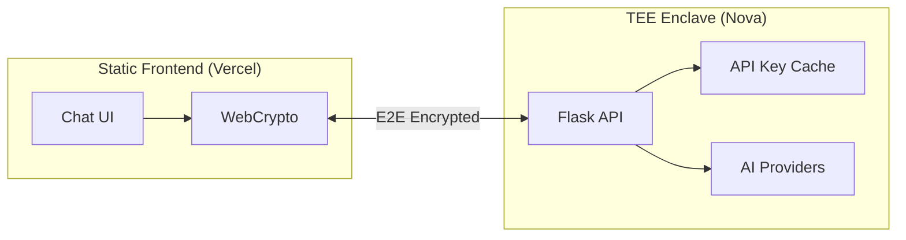
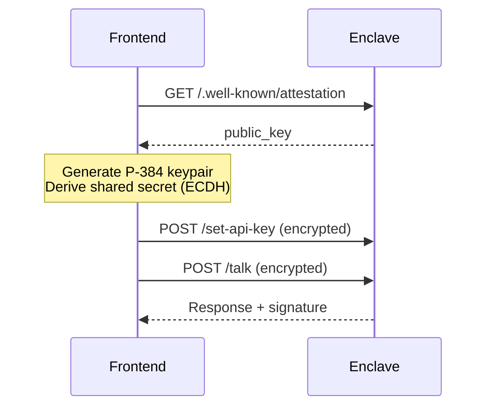

# New Chat Bot

A verifiable AI chat application running on the Sparsity Nova TEE platform with a pure static frontend.

## Architecture



## Features

| Feature | Description |
|---------|-------------|
| **E2E Encryption** | P-384 ECDH + AES-256-GCM |
| **API Key Caching** | Set once, cached in enclave |
| **Signed Responses** | ETH signature (EIP-191) |
| **Static Deploy** | Vercel / GitHub Pages |
| **Multi-Platform** | OpenAI, Anthropic, Gemini |

## Quick Start

```bash
# Enclave
cd enclave
python -m venv .venv && source .venv/bin/activate
pip install -r requirements.txt && python app.py

# Frontend
cd frontend && npm install && npm run dev
```

## API Endpoints

| Endpoint | Description |
|----------|-------------|
| `GET /` | Health check (`api_key_available` status) |
| `POST /set-api-key` | Set API key (encrypted) |
| `POST /talk` | Chat (encrypted) |
| `GET /.well-known/attestation` | Attestation (runtime) |

## Encryption Flow



**Crypto specs:** P-384 ECDH → HKDF-SHA256 → AES-256-GCM (32-byte nonce)

## Project Structure

```
new-chat-bot/
├── enclave/           # TEE backend
│   ├── app.py         # Flask + API key caching
│   ├── enclave.py     # ECDH encryption
│   └── ai_models/     # OpenAI, Anthropic, Gemini
└── frontend/          # Next.js static site
    ├── src/lib/       # crypto.ts, attestation.ts
    └── src/app/       # page.tsx, verify/
```

## Deploy

**Enclave:** `enclaver build && enclaver push`

**Frontend:** `npm run build` → deploy `out/` to Vercel
