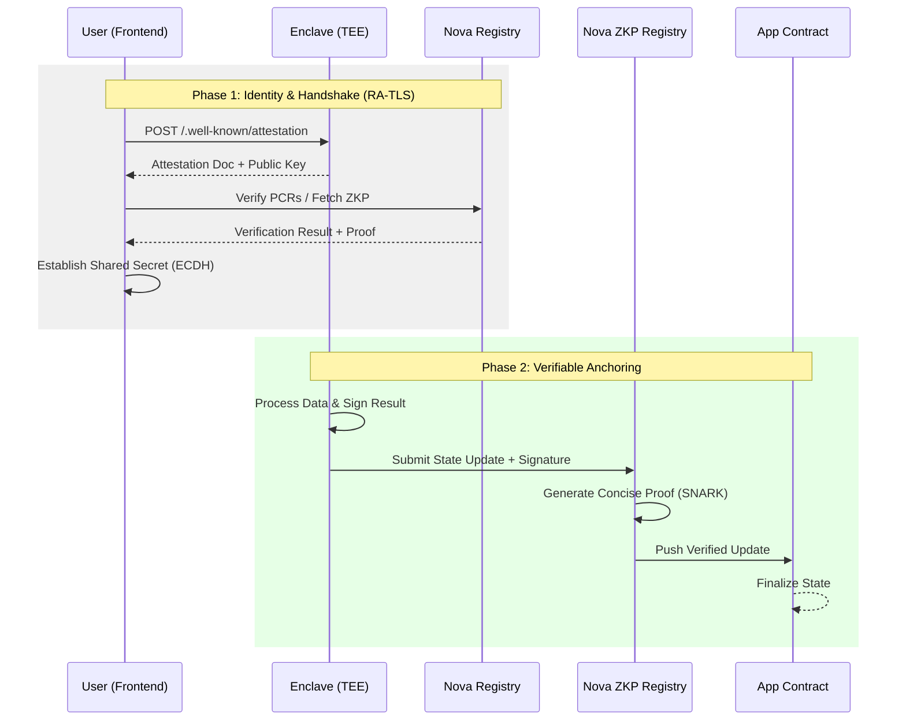

# Tutorial: Building & Deploying on Nova

This tutorial guides you through developing a production-ready, verifiable TEE application on the [Sparsity Nova Platform](https://sparsity.cloud). You will learn to use the Nova App Template to implement secure storage, internet-to-chain oracles, and RA-TLS encrypted communication.

---

## Table of Contents
1. [Architecture Overview](#1-architecture-overview)
2. [Setup Development Environment](#2-setup-development-environment)
3. [Develop Enclave Application](#3-develop-enclave-application)
4. [Develop Frontend Interface](#4-develop-frontend-interface)
5. [Smart Contract & The Trust Anchor](#5-smart-contract--the-trust-anchor)
6. [Bundle and Test Locally](#6-bundle-and-test-locally)
7. [Deploy to Nova Platform](#7-deploy-to-nova-platform)
8. [Verify & Troubleshooting](#8-verify--troubleshooting)

---

## 1. Architecture Overview

### 1.1 Roles
The Nova ecosystem consists of several components working together to ensure verifiability:

| Role | Description |
|------|-------------|
| **Enclave (TEE)** | A secure container running in AWS Nitro Enclaves. It holds private keys and handles sensitive logic. |
| **Frontend (Browser)** | A React app that verifies the Enclave's identity and establishes an encrypted channel (RA-TLS). |
| **App Contract** | Serves as the immutable "Anchor" on-chain. It stores the TEE's state hashes and verified identity. |
| **S3 Storage** | Encrypted persistent storage provided by Nova, isolated to your specific app instance. |
| **Nova Registry** | A centralized registry that manages TEE identity registrations and verifies hardware measurements. |
| **Nova ZKP Registry** | Generates and stores Zero-Knowledge Proofs for TEE attestation, allowing for ultra-fast on-chain verification. |

### 1.2 Data Flow
The following diagram illustrates how your application interacts with the user and the blockchain:



---

## 2. Setup Development Environment

```bash
# Clone the template
git clone https://github.com/sparsity-xyz/nova-examples.git
cd nova-examples/nova-app-template

# Install all components
make install-frontend
make install-enclave
```

> [!TIP]
> **Simulation Mode**: When running locally, the SDK (`odyn.py`) connects to `mockup.sparsity.cloud:18000`. This allows you to test 90% of your logic (signing, S3, attestation) without needing a real TEE.

---

## 3. Develop Enclave Application

The enclave is a **FastAPI** service. You can modularize your logic into:

### 3.1 Business Logic & API (`enclave/routes.py`)
Add your custom endpoints here.
- Use `odyn.s3_put()` / `odyn.s3_get()` for persistent data.
- Use `odyn.sign_message()` to prove results were generated by your TEE.

```python
@router.post("/compute")
def compute(req: Data):
    result = perform_sensitive_task(req.val)
    # Proof of execution
    return odyn.sign_message(f"Computed: {result}")
```

### 3.2 Background Tasks (`enclave/tasks.py`)
Ideal for Oracles or state sync.
- **Oracle Pattern**: Fetch internet data (`requests.get`) -> Process -> Sign Tx -> Push to Chain.
- **State Hashing**: Periodically hash your S3 state and update the on-chain `stateHash`.
- **Event Listener**: Poll `StateUpdateRequested` events and respond with a signed on-chain update.

---

## CORS Configuration (Cross-Origin Frontends)

Because the frontend may be hosted on any domain, the template allows cross-origin access by default (`CORS_ORIGINS=*`). If you need credentials (cookie/Authorization), set `CORS_ORIGINS` to an explicit allowlist and keep `CORS_ALLOW_CREDENTIALS=true`. Configuration lives in [enclave/app.py](enclave/app.py).

## 4. Develop Frontend Interface

Located in `frontend/`. It's a **Next.js** application.

- **`lib/crypto.ts`**: Handles client-side ECDH and AES-GCM.
- **`lib/attestation.ts`**: Handles COSE/CBOR parsing for Nitro documents.
- **`app/page.tsx`**: The main UI. Use `EnclaveClient.callEncrypted()` to send data that only the TEE can see.

---

## 5. Smart Contract & The Trust Anchor

To make your app verifiable, deploy an **app contract** that extends `NovaAppBase`.

This template includes `ETHPriceOracleApp` (recommended) which adds an on-chain ETH/USD price + request/update events on top of `NovaAppBase`.

### Automated Registration
Nova platform bridges the gap between your TEE and your Contract:
1. **Deploy Contract**: Deploy `ETHPriceOracleApp` (or any `NovaAppBase`-derived contract) to your target chain.
2. **Nova Setup**: In the Nova Console, enter your **Contract Address** during app creation.
3. **Registration**: When the TEE starts, Nova Platform automatically registers its hardware wallet address in your contract by calling `registerTEEWallet` via the Nova Registry.

### Nova App Contract Deployment Flow
1. Deploy the app contract (must extend [contracts/src/ISparsityApp.sol](contracts/src/ISparsityApp.sol))
2. Verify the contract on Base Sepolia
3. Call `setNovaRegistry` to set the Nova Registry contract address
4. Create the app on the Nova platform with the contract address
5. ZKP Registration Service generates proofs and registers/verifies the app in the Nova Registry
6. Nova Registry calls `registerTEEWallet` on your app contract

---

## 6. Bundle and Test Locally

Before deployment, ensure the frontend and backend work together:

```bash
# 1. Build and sync frontend
make build-frontend

# 2. Run local Docker (simulates the TEE environment)
make docker-run
```

Visit `http://localhost:8000/frontend`. Test the S3 storage and Oracle demo.

---

## 7. Deploy to Nova Platform

### Step 2: Create App on Nova
Go to the [Nova Platform Console](https://nova.sparsity.cloud), click **Create App**, and:
1. Select your repository/branch.
2. Enter **8000** as the **App Listening Port**.
3. **Register App in Nova Registry**: This happens automatically when you create the app; Nova assigns a unique App ID and initializes the registry entry.
4. **Enter your Contract Address**: This is the address of your deployed app contract (e.g. `ETHPriceOracleApp`).
5. Configure your S3 credentials if using persistent storage.

> [!IMPORTANT]
> This repo's enclave code reads the contract address from [enclave/config.py](enclave/config.py) (`CONTRACT_ADDRESS`). Ensure the value committed/configured there matches what you enter in the Nova Console.

> [!NOTE]
> **Automatic Management**: In production, Nova automatically handles **S3 buckets** and **Egress policies**. The platform injects these configurations directly into your enclave at runtime.

---

## 8. Verify & Troubleshooting

### Verification Checklist
- [ ] **Shield Icon**: In the demo UI, check if the PCR measurements match your build.
- [ ] **On-Chain Check**: Verify the `teeWalletAddress` in your contract matches the address in the `/status` endpoint.
- [ ] **Encryption**: Confirm `/api/echo` works via "Encrypted Send" (this proves RA-TLS is healthy).

### Common Issues
| Issue | Potential Cause | Solution |
|-------|-------|----------|
| **404 on UI** | Frontend not bundled | Run `make build-frontend` before building the image. |
| **Attestation Fail** | Non-TEE environment | Check `IN_ENCLAVE` variable; ensure `make dev-enclave` is used for local tests. |
| **S3 Error** | Provisioning delay | Wait 1-2 minutes after first deployment for S3 permissions to propagate. |
| **Contract Fail** | Wrong Address | Ensure the address in Nova Console matches your deployed contract. |

---

## Summary
You have built a fully verifiable application! Your code is now protected by **AWS Nitro** hardware, your identity is proven via **Attestation**, and your state is anchored to your **App Contract**. 

**Ready to scale?** Invite users to verify your PCR measurements and prove your app is running exactly the code you promised. 🚀🛡️
