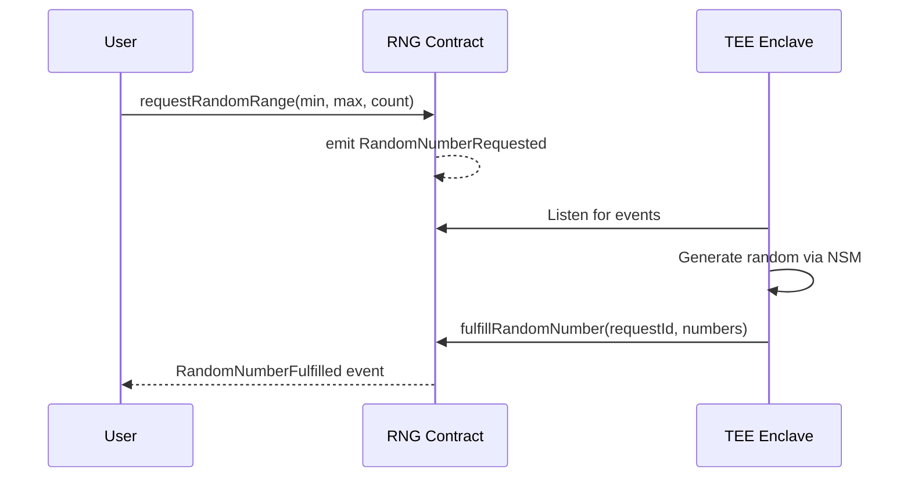

# RNG Oracle

A Verifiable Random Number Generator built on the [Sparsity Nova Platform](https://sparsity.cloud). Uses TEE hardware random to generate cryptographically secure random numbers and fulfills on-chain requests.

> 📖 **[Development Tutorial](./tutorial.md)** — Step-by-step guide to build and deploy this oracle.


## How It Works



## Features

| Feature               | Description                                           |
|-----------------------|-------------------------------------------------------|
| **Hardware RNG**      | Uses AWS Nitro NSM for cryptographic randomness       |
| **Verifiable**        | TEE attestation proves code integrity                 |
| **Callback Support**  | Optional automatic delivery to user contracts         |
| **On-Chain Registry** | Nova Platform auto-registers TEE as contract operator |

## Quick Start

```bash
# 1. Deploy contract
cd contract && npm install
npx hardhat run scripts/deploy-rng.js --network baseSepolia

# 2. Run enclave service (local testing)
cd enclave && pip install -r requirements.txt
IN_ENCLAVE=false python main.py
```

## Project Structure

```
rng-oracle/
├── contract/          # Solidity smart contracts (Hardhat)
│   ├── contracts/     # RandomNumberGenerator.sol
│   └── scripts/       # Deployment scripts
├── enclave/           # Python TEE service
│   ├── main.py        # FastAPI + event listener
│   └── odyn.py        # TEE API wrapper
└── consumer/          # React frontend (Vite)
```

## API Endpoints

| Endpoint              | Method | Description              |
|-----------------------|--------|--------------------------|
| `/`                   | GET    | Service status           |
| `/request/{id}`       | GET    | Get request details      |
| `/consumer`           | GET    | Consumer frontend UI     |

## For Users

Request random numbers via the contract:

```javascript
// Request
const tx = await rngContract.requestRandomRange(1, 100, 3);
const receipt = await tx.wait();

// Listen for result
rngContract.on("RandomNumberFulfilled", (requestId, numbers) => {
    console.log("Random numbers:", numbers);
});
```

Or use callback contracts — see [tutorial.md](./tutorial.md#95-callback-contract-integration).

## Deploy to Nova Platform

See the **[Development Tutorial](./tutorial.md)** for complete deployment instructions.

## License

Apache-2.0