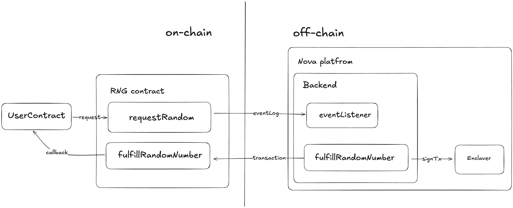

# Random Number Generator

A demo application showing how a true random number generator runs on the Sparsity Nova Platform using TEE (Trusted Execution Environment).

## Architecture



### Components

#### RNG Contract (`RandomNumberGenerator.sol`)
A smart contract that provides off-chain assisted true random numbers.
- Users submit random number requests on-chain
- Implements `ISparsityApp` interface for TEE wallet registration
- Supports optional callback to user contracts via `IRNGCallback`

#### Nova Platform
The on-chain registry and management layer of the Nova system.
- Registers TEE wallets and authorizes operators
- Coordinates trusted computation flows across the Nova ecosystem

#### Enclave Service
The off-chain TEE service responsible for:
- Listening to on-chain `RandomNumberRequested` events
- Generating cryptographically secure random numbers inside the enclave
- Signing and submitting fulfillment transactions

#### User Contract (Optional)
A smart contract implemented by the user that receives random numbers through the `IRNGCallback` interface.
This allows developers to build lotteries, games, or autonomous agents that depend on secure randomness.

## Project Structure

```
random-number-generator/
├── README.md                 # This file
├── architecture.png          # Architecture diagram
├── contract/                 # Smart contracts (Hardhat)
│   ├── contracts/
│   │   ├── RandomNumberGenerator.sol   # Main RNG contract
│   │   ├── ISparsityApp.sol            # Nova platform interface
│   │   └── TESTRNGCallback.sol         # Example callback contract
│   ├── scripts/              # Deployment scripts
│   ├── test/                 # Contract tests
│   ├── hardhat.config.js
│   └── package.json
└── enclave/                  # TEE enclave service
    ├── main.py               # FastAPI service entry point
    ├── enclave.py            # Enclave API wrapper
    ├── config.py             # Configuration
    ├── abi.json              # Contract ABI
    ├── requirements.txt      # Python dependencies
    ├── Dockerfile            # Container build
    └── README.md             # Enclave service docs
```

## Local Testing

### 1. Deploy Contract

```bash
cd contract
npm install
```

Start local node:
```bash
npx hardhat node
```

Deploy contract (in another terminal):
```bash
npm run deploy:local
```

### 2. Configure Mock TEE Wallet

To set up a mock TEE wallet for local testing:

```bash
# Set the registry address (use any account for local testing)
REGISTRY_ADDRESS=0xf39Fd6e51aad88F6F4ce6aB8827279cffFb92266 \
  npx hardhat run scripts/set-registry.js --network localhost

# Register a TEE wallet as operator
TEE_WALLET_ADDRESS=0x50a1c7EaA1CC0e0a8D3a02681C87b6A3C75f80d8 \
  npx hardhat run scripts/register-tee-wallet.js --network localhost
```

### 3. Start Enclave Service

```bash
cd enclave
python3 -m venv .venv
source .venv/bin/activate
pip install -r requirements.txt
python main.py
```

The service will start on `http://localhost:8000`.

### 4. Test Random Number Generation

```bash
cd contract

# Generate random number requests
npm run test:local

# Check results
npm run check:local
```

The enclave service will automatically detect requests and fulfill them with random numbers.

## Deploy on Sparsity Nova Platform

### 1. Deploy Contract to Base Sepolia

```bash
cd contract
cp .env.example .env
# Edit .env with your DEPLOYMENT_PRIVATE_KEY
```

Deploy:
```bash
npm run deploy:sepolia
```

Verify contract:
```bash
npx hardhat verify --network baseSepolia <CONTRACT_ADDRESS> <REGISTRY_CONTRACT>
```

### 2. Deploy on Nova Platform

1. Go to [https://nova.sparsity.ai/](https://nova.sparsity.ai/)
2. Create a new app with the enclave service
3. Deploy and wait for registration

### 3. Get TEE Wallet Address

After the app is registered on-chain:

```bash
curl <APP_ENDPOINT>
```

Response:
```json
{
    "service": "Random Number Generator",
    "version": "1.0.0",
    "status": "running",
    "is_operator": true,
    "contract_address": "0x...",
    "operator": "0x...",
    "operator_balance": 0.998857,
    "processed_requests": 0
}
```

### 4. Fund the Operator

Fund the `operator` address shown above with ETH on Base Sepolia so it can submit fulfillment transactions.

## API Endpoints

| Endpoint | Method | Description |
|----------|--------|-------------|
| `/` | GET | Service status and info |
| `/request/{request_id}` | GET | Get request details |
| `/attestation` | GET | Get TEE attestation document |

## Environment Variables

### Contract (.env)
```
DEPLOYMENT_PRIVATE_KEY=0x...
BASE_SEPOLIA_RPC=https://sepolia.base.org
BASESCAN_API_KEY=...
```

### Enclave (config.py)
```python
CONTRACT_ADDRESS = "0x..."
RPC_URL = "https://sepolia.base.org"
ENCLAVER_ENDPOINT = "http://127.0.0.1:18000"
```

## License

Apache-2.0