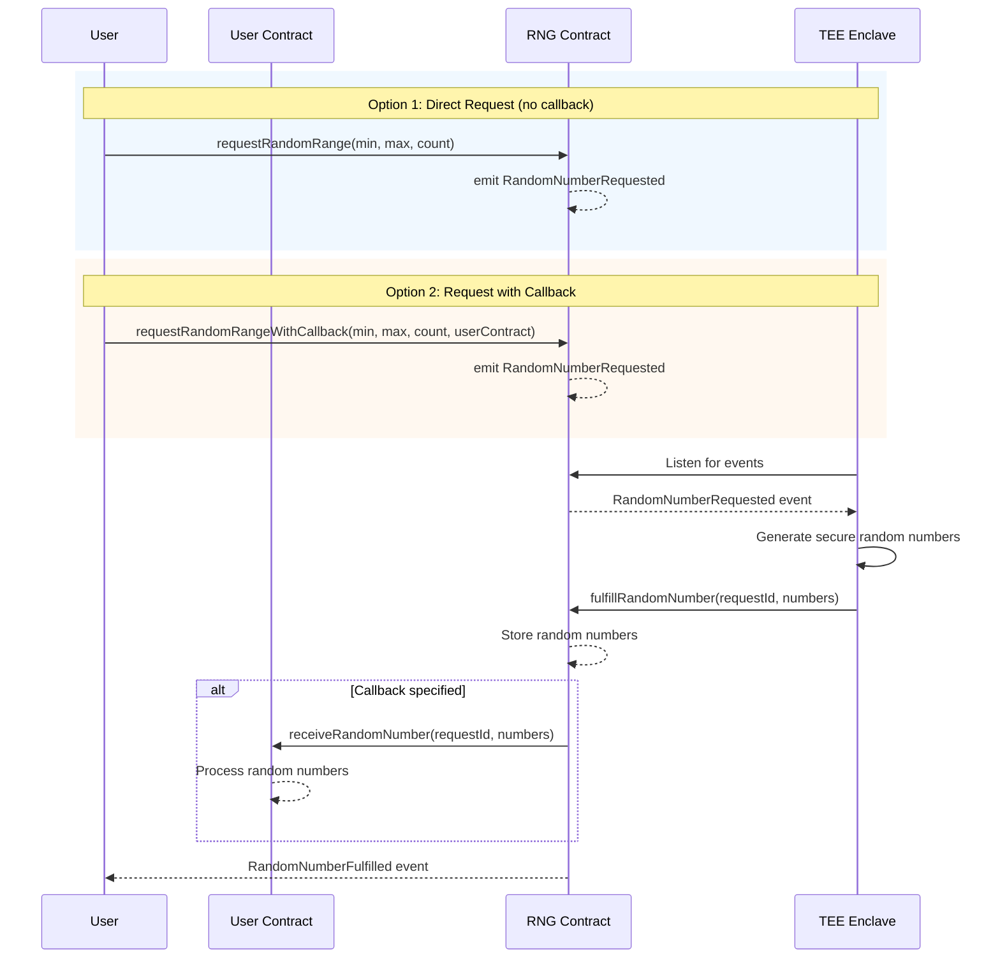

# RNG Oracle

The RNG Oracle is a Verifiable Random Number Generator built on the [Sparsity Nova Platform](https://sparsity.cloud). It uses a Trusted Execution Environment (TEE) to generate cryptographically secure random numbers and fulfills on-chain requests, enabling developers to build trustless applications like lotteries, games, and autonomous agents.


## How It Works

1. **User** submits a random number request to the `RandomNumberGenerator` smart contract.
2. **Enclave Service** (running in TEE) listens for `RandomNumberRequested` events.
3. **Enclave** generates secure random numbers using its hardware random source.
4. **Enclave** signs and submits a fulfillment transaction on-chain.
5. **Contract** stores the random numbers and optionally calls the user's callback contract.



---

# For Developers

This section describes how to deploy and run the RNG Oracle on the Sparsity Nova Platform.

## Project Structure

```
rng-oracle/
├── README.md                 # This file
├── architecture.png          # Architecture diagram
├── contract/                 # Smart contracts (Hardhat)
│   ├── contracts/
│   │   ├── RandomNumberGenerator.sol   # Main RNG contract
│   │   ├── ISparsityApp.sol            # Nova platform interface
│   │   └── TESTRNGCallback.sol         # Example callback contract
│   ├── scripts/              # Deployment scripts
│   ├── test/                 # Contract tests
│   ├── hardhat.config.js
│   └── package.json
└── enclave/                  # TEE enclave service
    ├── main.py               # FastAPI service entry point
    ├── odyn.py               # Odyn API wrapper
    ├── config.py             # Configuration
    ├── abi.json              # Contract ABI
    ├── requirements.txt      # Python dependencies
    ├── Dockerfile            # Container build
    └── README.md             # Enclave service docs
```

## Step 1: Deploy Smart Contract

### Local Testing

```bash
cd contract
npm install
npx hardhat node              # Start local node in one terminal
npm run deploy:local          # Deploy in another terminal
```

### Base Sepolia Testnet

```bash
cd contract
cp .env.example .env
# Edit .env with your DEPLOYMENT_PRIVATE_KEY

npm run deploy:sepolia
```

Verify:
```bash
npx hardhat verify --network baseSepolia <CONTRACT_ADDRESS> <REGISTRY_CONTRACT>
```

## Step 2: Deploy Enclave Service on Nova Platform

1. Go to [https://sparsity.cloud](https://sparsity.cloud)
2. Create a new app with the `enclave/` directory
3. Deploy and wait for registration

After deployment, get the TEE wallet address:

```bash
curl <APP_ENDPOINT>
```

Response:
```json
{
    "service": "RNG Oracle",
    "version": "1.0.0",
    "status": "running",
    "is_operator": false,
    "contract_address": "0x...",
    "operator": "0x...",
    "operator_balance": 0.0
}
```

## Step 3: Register TEE Wallet as Operator

The enclave's wallet must be registered as an operator on your contract.

**Option A: Via Nova Registry (Recommended)**

If your contract is registered with the Nova Platform, the registry will automatically call `registerTEEWallet()` on your contract.

**Option B: Direct Registration**

```bash
cd contract
TEE_WALLET_ADDRESS=0x... npx hardhat run scripts/register-operator.js --network baseSepolia
```

## Step 4: Fund the TEE Wallet

Send ETH to the `operator` address shown in the service status so it can submit fulfillment transactions.

```bash
# Example: Send 0.1 ETH from your wallet
```

Once funded and authorized, the enclave service will automatically start processing random number requests.

## API Endpoints

| Endpoint | Method | Description |
|----------|--------|-------------|
| `/` | GET | Service status and info |
| `/request/{request_id}` | GET | Get request details |
| `/attestation` | GET | Get TEE attestation document |

## Environment Variables

### Contract (.env)
```
DEPLOYMENT_PRIVATE_KEY=0x...
BASE_SEPOLIA_RPC=https://sepolia.base.org
BASESCAN_API_KEY=...
```

### Enclave (config.py)
```python
CONTRACT_ADDRESS = "0x..."
RPC_URL = "https://sepolia.base.org"
```

---

# For Users

This section describes how to interact with a deployed RNG Oracle to request random numbers.

## Using the Frontend

A React-based frontend is available at [rng-oracle-frontend](../rng-oracle-frontend/).

### Quick Start

```bash
cd ../rng-oracle-frontend
npm install
npm run dev
```

Open [http://localhost:5173](http://localhost:5173) in your browser.

### Steps to Request Random Numbers

1. **Connect Wallet**: Click "Connect Wallet" and approve in MetaMask.
2. **Switch Network**: Switch to Base Sepolia network if prompted.
3. **Set Contract Address**: Enter the RNG contract address (or use default).
4. **Request Random Number**: Set min/max values and click "Request Random Number".
5. **View Results**: See your request in "Your Results" and wait for fulfillment.
6. **Monitor Events**: All contract events appear in the "RNG Contract Events" section.

## Using the Smart Contract Directly

You can also interact with the contract directly using ethers.js or web3.js.

### Request Random Numbers

```javascript
const tx = await rngContract.requestRandomRange(1, 100, 1); // min, max, count
const receipt = await tx.wait();
const requestId = receipt.events[0].args.requestId;
console.log("Request ID:", requestId.toString());
```

### Query Request Status

```javascript
const request = await rngContract.getRequest(requestId);
console.log("Status:", request.status); // 0=Pending, 1=Fulfilled, 2=Cancelled
console.log("Random Numbers:", request.randomNumbers);
```

### Listen for Fulfillment

```javascript
rngContract.on("RandomNumberFulfilled", (requestId, randomNumbers) => {
    console.log("Fulfilled:", requestId.toString(), randomNumbers);
});
```

## Integrating with Your Contract

Implement the `IRNGCallback` interface to receive random numbers in your own contract:

```solidity
interface IRNGCallback {
    function receiveRandomNumber(uint256 requestId, uint256[] calldata randomNumbers) external;
}

contract MyLottery is IRNGCallback {
    function receiveRandomNumber(uint256 requestId, uint256[] calldata randomNumbers) external override {
        // Use the random numbers
    }
}
```

When requesting, pass your contract address as the callback:

```javascript
await rngContract.requestRandomRangeWithCallback(1, 100, 1, myLotteryAddress);
```

---

## License

Apache-2.0