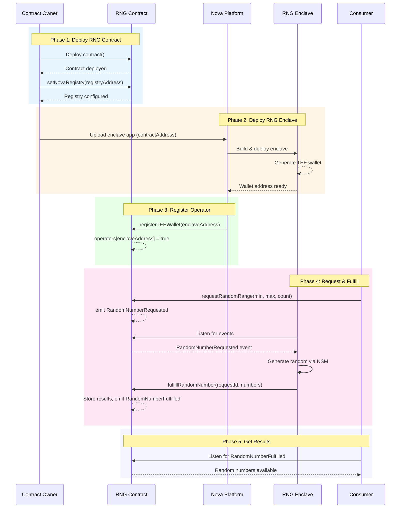

# RNG Oracle Development Tutorial

This tutorial guides you through developing a Verifiable Random Number Generator (RNG Oracle) on the [Sparsity Nova Platform](https://sparsity.cloud). You will learn to build both on-chain smart contracts and off-chain TEE (Trusted Execution Environment) applications.

---

## Table of Contents

1. [Architecture Overview](#1-architecture-overview)
2. [Develop On-Chain Contract](#2-develop-on-chain-contract)
3. [Deploy Contract to Chain](#3-deploy-contract-to-chain)
4. [Develop Off-Chain Application](#4-develop-off-chain-application)
5. [Create Dockerfile for Off-Chain App](#5-create-dockerfile-for-off-chain-app)
6. [Deploy Enclave to Nova Platform](#6-deploy-enclave-to-nova-platform)
7. [Verify On-Chain Registry](#7-verify-on-chain-registry)
8. [Verify Enclave App Status](#8-verify-enclave-app-status)
9. [Develop Consumer Application](#9-develop-consumer-application)
10. [Troubleshooting](#10-troubleshooting)

---

## 1. Architecture Overview

### 1.1 Roles

The RNG Oracle system consists of four key components:

| Role | Description |
|------|-------------|
| **RNG Contract** | On-chain smart contract that receives random number requests and stores results |
| **RNG Enclave** | Off-chain TEE application that generates secure random numbers and fulfills requests |
| **Nova Platform** | Cloud platform that hosts enclave apps and manages operator registration |
| **Consumer** | End users or dApps that request random numbers from the RNG contract |

```
┌─────────────────────────────────────────────────────────────────────────┐
│                        RNG Oracle Architecture                          │
├─────────────────────────────────────────────────────────────────────────┤
│                                                                         │
│   ┌──────────────┐                           ┌──────────────────────┐   │
│   │   Consumer   │                           │   Nova Platform      │   │
│   │  (User/dApp) │                           │   ┌──────────────┐   │   │
│   └──────┬───────┘                           │   │ RNG Enclave  │   │   │
│          │                                   │   │  (TEE App)   │   │   │
│          │ Request                           │   └──────┬───────┘   │   │
│          ▼                                   │          │           │   │
│   ┌──────────────┐         Events            │          │ Fulfill   │   │
│   │ RNG Contract │◄───────────────────-──────┼──────────┘           │   │
│   │  (On-Chain)  │                           │                      │   │
│   └──────────────┘                           └──────────────────────┘   │
│          │                                                              │
│          └─── Results ───► Consumer                                     │
│                                                                         │
└─────────────────────────────────────────────────────────────────────────┘
```

### 1.2 Sequence Diagram

The complete workflow from deployment to random number generation:



---

## 2. Develop On-Chain Contract

### 2.1 Project Setup

```bash
mkdir rng-oracle && cd rng-oracle
mkdir contract && cd contract
npm init -y
npm install --save-dev hardhat @nomicfoundation/hardhat-toolbox
npm install @openzeppelin/contracts
npx hardhat init
```

### 2.2 Implement Nova Interface

The Nova interface allows the Nova Registry to register TEE wallet addresses as operators.

📄 **Source**: [contract/contracts/ISparsityApp.sol](contract/contracts/ISparsityApp.sol)

### 2.3 Implement RNG Contract

The main RNG contract implements the following key features:

- Implements `ISparsityApp` to allow Nova Registry to call `registerTEEWallet()`
- `operators` mapping whitelists TEE wallet addresses
- Emits `RandomNumberRequested` events for off-chain listening
- Only operators can call `fulfillRandomNumber()`
- Supports optional callback contracts for automatic result delivery

📄 **Source**: [contract/contracts/RandomNumberGenerator.sol](contract/contracts/RandomNumberGenerator.sol)

### 2.4 Write Tests

The test suite covers request creation, fulfillment, and authorization checks.

📄 **Source**: [contract/test/RNG.test.js](contract/test/RNG.test.js)

Run tests:

```bash
npx hardhat test
```

---

## 3. Deploy Contract to Chain

### 3.1 Configure Environment

Copy `.env.example` to `.env` and fill in your values:

📄 **Template**: [contract/.env.example](contract/.env.example)

### 3.2 Configure Hardhat

📄 **Source**: [contract/hardhat.config.js](contract/hardhat.config.js)

### 3.3 Create Deployment Script

The deployment script deploys the contract, exports ABI, and updates the enclave config.

📄 **Source**: [contract/scripts/deploy-rng.js](contract/scripts/deploy-rng.js)

### 3.4 Deploy and Verify

```bash
# Deploy
npx hardhat run scripts/deploy-rng.js --network baseSepolia

# Verify on Basescan
npx hardhat verify --network baseSepolia <CONTRACT_ADDRESS> <NOVA_REGISTRY_ADDRESS>
```

### 3.5 Set Nova Registry Address

After deploying the RNG contract, you **must** set the Nova Registry address. This allows the Nova Registry to call `registerTEEWallet()` to authorize TEE operators.

📄 **Source**: [contract/scripts/set-registry.js](contract/scripts/set-registry.js)

Run the script:

```bash
REGISTRY_ADDRESS=0x... npx hardhat run scripts/set-registry.js --network baseSepolia
```

> [!IMPORTANT]
> This step is **required** for the Nova Platform to automatically register TEE wallets as operators. Without this, the enclave will not be authorized to fulfill random number requests.

---

## 4. Develop Off-Chain Application

### 4.1 Project Structure

```
enclave/
├── main.py           # FastAPI service entry point
├── odyn.py           # Odyn API wrapper (enclave services)
├── config.py         # Configuration
├── abi.json          # Contract ABI
├── requirements.txt  # Python dependencies
└── Dockerfile        # Container build
```

### 4.2 Configuration

The config file contains contract address, RPC endpoint, and ABI loading.

📄 **Source**: [enclave/config.py](enclave/config.py)

### 4.3 Odyn Wrapper

The Odyn wrapper provides an interface to the enclave's TEE services:

- **`eth_address()`**: Get the TEE wallet address
- **`get_random_bytes()`**: Fetch hardware random from AWS Nitro's NSM
- **`sign_message()`** / **`sign_data()`**: Sign messages using TEE private key
- **`encrypt_data()`** / **`decrypt_data()`**: ECDH-based encryption

**Key Points:**
- In enclave (`IN_ENCLAVE=True`): Uses `localhost:18000` (real Odyn)
- In development: Uses mock API at `odyn.sparsity.cloud:18000`

📄 **Source**: [enclave/odyn.py](enclave/odyn.py)

### 4.4 Main Application

The main application includes:

- **FastAPI service** with status endpoint
- **Web3 connection** to blockchain
- **Event listener** for `RandomNumberRequested` events
- **Transaction signing** via Odyn API
- **Random number generation** using NSM hardware random

📄 **Source**: [enclave/main.py](enclave/main.py)

### 4.5 Dependencies

📄 **Source**: [enclave/requirements.txt](enclave/requirements.txt)

### 4.6 Export Contract ABI

The deploy script automatically exports ABI to enclave. To manually export:

```bash
cd contract
npx hardhat compile
cat artifacts/contracts/RandomNumberGenerator.sol/RandomNumberGenerator.json | jq '.abi' > ../enclave/abi.json
```

---

## 5. Create Dockerfile for Off-Chain App

### 5.1 Dockerfile

The Dockerfile sets `IN_ENCLAVE=True` for production deployment.

📄 **Source**: [enclave/Dockerfile](enclave/Dockerfile)

### 5.2 Build and Test Locally

```bash
cd enclave

# Build
docker build -t rng-oracle-dev .

# Run (uses mock Odyn API)
docker run -p 8000:8000 rng-oracle-dev
```

### 5.3 Manual Operator Registration for Testing

Before the enclave can fulfill requests, you need to register it as an operator:

1. Get the operator address from the running service:
   ```bash
   curl http://localhost:8000/
   ```

2. Register the operator in your contract:
   ```bash
   cd contract
   TEE_WALLET_ADDRESS=0x... npx hardhat run scripts/register-operator.js --network baseSepolia
   ```

3. Fund the operator wallet with some ETH for gas.

4. Test by sending a random number request to the contract!

---

## 6. Deploy Enclave to Nova Platform

### 6.1 Prepare for Production

The provided Dockerfile already has `IN_ENCLAVE=True` set for production.

📄 **Source**: [enclave/Dockerfile](enclave/Dockerfile)

### 6.2 Deploy to Nova Platform

1. Go to [https://sparsity.cloud](https://sparsity.cloud)
2. Create a new application
3. Upload your `enclave/` directory
4. Configure:
   - **Contract Address**: Your deployed RNG contract address
   - **Network**: Base Sepolia
5. Deploy the application
6. Wait for the enclave to build and start

### 6.3 Get Enclave Information

After deployment, the Nova Platform will:
1. Build your Docker image into an EIF (Enclave Image File)
2. Deploy to an AWS Nitro Enclave
3. Register the TEE wallet with your contract automatically

Get the service endpoint:
```bash
curl https://<your-app>.nova.sparsity.cloud/
```

Response:
```json
{
    "service": "RNG Oracle",
    "status": "running",
    "is_operator": true,
    "contract_address": "0x...",
    "operator": "0x...",
    "operator_balance": 0.1
}
```

---

## 7. Verify On-Chain Registry

Verify that the Nova Platform has registered your enclave:

### 7.1 Check Operator Status

```javascript
// Using ethers.js
const isOperator = await rngContract.isOperator(enclaveAddress);
console.log("Is operator:", isOperator);
```

### 7.2 Check on Basescan

1. Go to your contract on [Basescan](https://sepolia.basescan.org)
2. Navigate to "Read Contract"
3. Call `isOperator` with the enclave address
4. Should return `true`

### 7.3 Verify Registry Events

Check for `OperatorUpdated` events:

```javascript
const filter = rngContract.filters.OperatorUpdated();
const events = await rngContract.queryFilter(filter);
console.log("Operator events:", events);
```

---

## 8. Verify Enclave App Status

### 8.1 Check Service Health

```bash
curl https://<your-app>.nova.sparsity.cloud/
```

Verify:
- `status`: "running"
- `is_operator`: true
- `operator_balance`: > 0 (has ETH for gas)

### 8.2 Check Attestation

View the TEE attestation document on the Nova Platform:

1. Go to [https://sparsity.cloud/explore](https://sparsity.cloud/explore)
2. Find your deployed application
3. View the attestation document proving the code is running inside a genuine AWS Nitro Enclave

### 8.3 Monitor Logs

Check the Nova Platform dashboard for:
- Successful event processing
- Transaction submissions
- Any errors or warnings

---

## 9. Develop Consumer Application

The repository includes a ready-to-use React frontend in the `consumer/` directory that allows users to interact with the RNG contract.

### 9.1 Consumer Project Structure

```
consumer/
├── src/                  # React source code
├── public/               # Static assets
├── dist/                 # Built files (after npm run build)
├── vite.config.js        # Vite configuration (base: '/consumer/')
├── package.json
└── README.md
```

### 9.2 Build the Consumer

```bash
cd consumer
npm install
npm run build
```

> **Note**: The `vite.config.js` is configured with `base: '/consumer/'` so assets load correctly when served from the `/consumer` endpoint.

### 9.3 Deployment Options

There are two ways to deploy the consumer frontend:

#### Option A: Mount in Enclave (Recommended)

The enclave service can serve the consumer frontend directly. This is the simplest approach:

1. Build the consumer:
   ```bash
   cd consumer
   npm run build
   ```

2. Copy to enclave:
   ```bash
   cp -r dist ../enclave/consumer-dist
   ```

3. The enclave's `main.py` automatically mounts `consumer-dist/` at `/consumer`:
   ```python
   consumer_path = os.path.join(os.path.dirname(__file__), "consumer-dist")
   self.app.mount("/consumer", StaticFiles(directory=consumer_path, html=True))
   ```

4. Access at: `https://<your-enclave-app>/consumer`

#### Option B: Standalone Deployment

Deploy the consumer frontend separately (e.g., on Vercel, Netlify, or any static hosting):

1. Update `vite.config.js` to use root base path:
   ```javascript
   export default defineConfig({
     plugins: [react()],
     base: '/',  // Change from '/consumer/' to '/'
   })
   ```

2. Build and deploy:
   ```bash
   npm run build
   # Deploy dist/ to your hosting provider
   ```

3. Configure the RNG contract address in the frontend settings.

### 9.4 Using the Consumer Frontend

1. **Connect Wallet**: Click "Connect Wallet" and approve in MetaMask
2. **Switch Network**: Switch to Base Sepolia if prompted
3. **Set Contract Address**: Enter the RNG contract address (or use default)
4. **Request Random Number**: Set min/max/count values and click "Request"
5. **View Results**: See your request status and wait for fulfillment

### 9.5 Callback Contract Integration

For on-chain applications that need random numbers, implement the `IRNGCallback` interface:

```solidity
// SPDX-License-Identifier: MIT
pragma solidity ^0.8.30;

interface IRandomNumberGenerator {
    function requestRandomRangeWithCallback(
        uint256 min, uint256 max, uint256 count, address callbackContract
    ) external returns (uint256);
}

interface IRNGCallback {
    function onRandomNumberFulfilled(uint256 requestId, uint256[] calldata randomNumbers) external;
}

contract SimpleLottery is IRNGCallback {
    address public rngContract;
    mapping(uint256 => uint256[]) public results;
    
    event LotteryResult(uint256 indexed requestId, uint256[] numbers);
    
    constructor(address _rngContract) {
        rngContract = _rngContract;
    }
    
    function drawLottery() external returns (uint256) {
        // Request 3 random numbers between 1-50
        return IRandomNumberGenerator(rngContract)
            .requestRandomRangeWithCallback(1, 50, 3, address(this));
    }
    
    function onRandomNumberFulfilled(
        uint256 requestId,
        uint256[] calldata randomNumbers
    ) external override {
        require(msg.sender == rngContract, "Only RNG contract");
        results[requestId] = randomNumbers;
        emit LotteryResult(requestId, randomNumbers);
    }
}
```

### 9.6 Direct Contract Interaction (JavaScript)

For programmatic access without the frontend:

```javascript
const { ethers } = require("ethers");

const provider = new ethers.JsonRpcProvider("https://sepolia.base.org");
const wallet = new ethers.Wallet(privateKey, provider);
const rngContract = new ethers.Contract(contractAddress, abi, wallet);

// Request random numbers
async function requestRandom() {
    const tx = await rngContract.requestRandomRange(1, 100, 3);
    const receipt = await tx.wait();
    
    const event = receipt.logs.find(log => {
        try {
            return rngContract.interface.parseLog(log).name === "RandomNumberRequested";
        } catch { return false; }
    });
    const requestId = rngContract.interface.parseLog(event).args.requestId;
    console.log("Request ID:", requestId.toString());
    return requestId;
}

// Listen for fulfillment
rngContract.on("RandomNumberFulfilled", (requestId, requester, randomNumbers) => {
    console.log("Fulfilled:", requestId.toString(), randomNumbers);
});
```

---

## 10. Troubleshooting

### Common Issues

| Issue | Cause | Solution |
|-------|-------|----------|
| "Not authorized operator" | TEE wallet not registered | Wait for Nova Registry or manually call `addOperator()` |
| Transactions failing | Insufficient ETH in operator wallet | Fund the operator wallet |
| No events received | Wrong `FROM_BLOCK` config | Set to a recent block or "latest" |
| Connection refused | Wrong RPC URL | Check `Config.RPC_URL` |
| Mock API in production | `IN_ENCLAVE` not set | Ensure Dockerfile sets `ENV IN_ENCLAVE=True` |

### Debugging Commands

```bash
# Check operator status
curl <ENCLAVE_URL>/

# Check specific request
curl <ENCLAVE_URL>/request/1

# Check contract on-chain
npx hardhat console --network baseSepolia
> const rng = await ethers.getContractAt("RandomNumberGenerator", "<ADDRESS>")
> await rng.isOperator("<OPERATOR_ADDRESS>")
```

### Getting Help

- [Nova Platform Documentation](https://sparsity.cloud/resources)
- [Sparsity Discord](https://discord.gg/sparsity)
- [GitHub Issues](https://github.com/sparsity-xyz/sparsity-nova-examples/issues)

---

## Summary

You have learned how to:

1. ✅ Design the RNG Oracle architecture with on-chain and off-chain components
2. ✅ Implement smart contracts with Nova Platform integration (`ISparsityApp`)
3. ✅ Deploy and verify contracts on Base Sepolia
4. ✅ Build off-chain enclave applications using Python and Odyn API
5. ✅ Generate cryptographically secure random numbers using NSM
6. ✅ Deploy to the Nova Platform as a TEE enclave
7. ✅ Verify on-chain operator registration
8. ✅ Build consumer applications that use the RNG service

**Congratulations!** You have successfully built a Verifiable Random Number Generator on the Sparsity Nova Platform! 🎉
