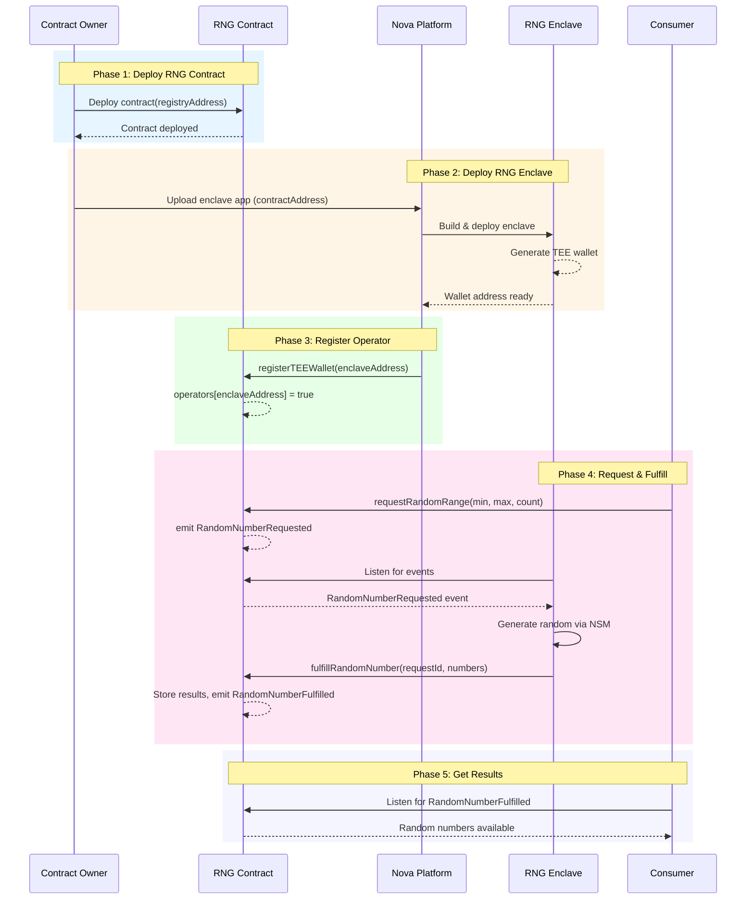

# RNG Oracle Development Tutorial

This tutorial guides you through developing a Verifiable Random Number Generator (RNG Oracle) on the [Sparsity Nova Platform](https://sparsity.cloud). You will learn to build both on-chain smart contracts and off-chain TEE (Trusted Execution Environment) applications.

---

## Table of Contents

1. [Architecture Overview](#1-architecture-overview)
2. [Develop On-Chain Contract](#2-develop-on-chain-contract)
3. [Deploy Contract to Chain](#3-deploy-contract-to-chain)
4. [Develop Off-Chain Application](#4-develop-off-chain-application)
5. [Create Dockerfile for Off-Chain App](#5-create-dockerfile-for-off-chain-app)
6. [Deploy Enclave to Nova Platform](#6-deploy-enclave-to-nova-platform)
7. [Verify On-Chain Registry](#7-verify-on-chain-registry)
8. [Verify Enclave App Status](#8-verify-enclave-app-status)
9. [Develop Consumer Application](#9-develop-consumer-application)
10. [Troubleshooting](#10-troubleshooting)

---

## 1. Architecture Overview

### 1.1 Roles

The RNG Oracle system consists of four key components:

| Role | Description |
|------|-------------|
| **RNG Contract** | On-chain smart contract that receives random number requests and stores results |
| **RNG Enclave** | Off-chain TEE application that generates secure random numbers and fulfills requests |
| **Nova Platform** | Cloud platform that hosts enclave apps and manages operator registration |
| **Consumer** | End users or dApps that request random numbers from the RNG contract |

```
┌─────────────────────────────────────────────────────────────────────────┐
│                        RNG Oracle Architecture                          │
├─────────────────────────────────────────────────────────────────────────┤
│                                                                         │
│   ┌──────────────┐                           ┌──────────────────────┐   │
│   │   Consumer   │                           │   Nova Platform      │   │
│   │  (User/dApp) │                           │   ┌──────────────┐   │   │
│   └──────┬───────┘                           │   │ RNG Enclave  │   │   │
│          │                                   │   │  (TEE App)   │   │   │
│          │ Request                           │   └──────┬───────┘   │   │
│          ▼                                   │          │           │   │
│   ┌──────────────┐         Events           │          │ Fulfill   │   │
│   │ RNG Contract │◄─────────────────────────┼──────────┘           │   │
│   │  (On-Chain)  │                           │                      │   │
│   └──────────────┘                           └──────────────────────┘   │
│          │                                                              │
│          └─── Results ───► Consumer                                     │
│                                                                         │
└─────────────────────────────────────────────────────────────────────────┘
```

### 1.2 Sequence Diagram

The complete workflow from deployment to random number generation:



---

## 2. Develop On-Chain Contract

### 2.1 Project Setup

```bash
mkdir rng-oracle && cd rng-oracle
mkdir contract && cd contract
npm init -y
npm install --save-dev hardhat @nomicfoundation/hardhat-toolbox
npm install @openzeppelin/contracts
npx hardhat init
```

### 2.2 Implement Nova Interface

Create `contracts/ISparsityApp.sol`:

```solidity
// SPDX-License-Identifier: Apache-2.0
pragma solidity ^0.8.30;

interface ISparsityApp {
    function registerTEEWallet(address teeWalletAddress) external;
}
```

This interface allows the Nova Registry to register TEE wallet addresses as operators.

### 2.3 Implement RNG Contract

Create `contracts/RandomNumberGenerator.sol`:

```solidity
// SPDX-License-Identifier: MIT
pragma solidity ^0.8.30;

import "@openzeppelin/contracts/access/Ownable.sol";
import "./ISparsityApp.sol";

/// @title RNG Callback Interface
interface IRNGCallback {
    function onRandomNumberFulfilled(
        uint256 requestId,
        uint256[] calldata randomNumbers
    ) external;
}

/// @title Random Number Generator
contract RandomNumberGenerator is Ownable, ISparsityApp {
    // Nova registry address
    address public novaRegistryAddress;

    // Authorized operators (TEE wallets)
    mapping(address => bool) public operators;

    // Request counter
    uint256 private requestCounter;

    // Request status enum
    enum RequestStatus { Pending, Fulfilled, Cancelled }

    // Random number request struct
    struct RandomRequest {
        address requester;
        uint256 timestamp;
        uint256 min;
        uint256 max;
        uint256 count;
        RequestStatus status;
        uint256[] randomNumbers;
        uint256 fulfilledAt;
        address callbackContract;
        bool callbackExecuted;
    }

    // Storage
    mapping(uint256 => RandomRequest) public requests;
    mapping(address => uint256[]) public userRequests;
    uint256 public callbackGasLimit = 200000;

    // Events
    event RandomNumberRequested(
        uint256 indexed requestId,
        address indexed requester,
        uint256 min,
        uint256 max,
        uint256 count,
        address callbackContract,
        uint256 timestamp
    );

    event RandomNumberFulfilled(
        uint256 indexed requestId,
        address indexed requester,
        uint256[] randomNumbers,
        uint256 timestamp
    );

    event OperatorUpdated(address indexed operator, bool status);

    // Modifiers
    modifier onlyOperator() {
        require(operators[msg.sender], "Not authorized operator");
        _;
    }

    modifier onlyRegistry() {
        require(msg.sender == novaRegistryAddress, "Not registry contract");
        _;
    }

    constructor(address registryAddress) Ownable(msg.sender) {
        novaRegistryAddress = registryAddress;
    }

    // === Request Functions (without callback) ===

    function requestRandomRange(
        uint256 min,
        uint256 max,
        uint256 count
    ) public returns (uint256) {
        return _requestRandomRange(min, max, count, address(0));
    }

    // === Request Functions (with callback) ===

    function requestRandomRangeWithCallback(
        uint256 min,
        uint256 max,
        uint256 count,
        address callbackContract
    ) public returns (uint256) {
        require(callbackContract != address(0), "Invalid callback contract");
        return _requestRandomRange(min, max, count, callbackContract);
    }

    function _requestRandomRange(
        uint256 min,
        uint256 max,
        uint256 count,
        address callbackContract
    ) internal returns (uint256) {
        require(max > min, "Invalid range");
        require(count > 0 && count <= 100, "Count must be 1-100");

        requestCounter++;
        uint256 requestId = requestCounter;

        requests[requestId] = RandomRequest({
            requester: msg.sender,
            timestamp: block.timestamp,
            min: min,
            max: max,
            count: count,
            status: RequestStatus.Pending,
            randomNumbers: new uint256[](0),
            fulfilledAt: 0,
            callbackContract: callbackContract,
            callbackExecuted: false
        });

        userRequests[msg.sender].push(requestId);

        emit RandomNumberRequested(
            requestId, msg.sender, min, max, count,
            callbackContract, block.timestamp
        );

        return requestId;
    }

    // === Operator Functions ===

    function fulfillRandomNumber(
        uint256 requestId,
        uint256[] calldata randomNumbers
    ) external onlyOperator {
        RandomRequest storage req = requests[requestId];
        require(req.status == RequestStatus.Pending, "Request not pending");
        require(randomNumbers.length == req.count, "Invalid count");

        // Verify range
        for (uint256 i = 0; i < randomNumbers.length; i++) {
            require(
                randomNumbers[i] >= req.min && randomNumbers[i] < req.max,
                "Random number out of range"
            );
        }

        req.randomNumbers = randomNumbers;
        req.status = RequestStatus.Fulfilled;
        req.fulfilledAt = block.timestamp;

        emit RandomNumberFulfilled(
            requestId, req.requester, randomNumbers, block.timestamp
        );

        // Execute callback if specified
        if (req.callbackContract != address(0) && !req.callbackExecuted) {
            _executeCallback(requestId, req.callbackContract, randomNumbers);
        }
    }

    function _executeCallback(
        uint256 requestId,
        address callbackContract,
        uint256[] memory randomNumbers
    ) internal {
        requests[requestId].callbackExecuted = true;
        try IRNGCallback(callbackContract).onRandomNumberFulfilled{
            gas: callbackGasLimit
        }(requestId, randomNumbers) {
            // Success
        } catch {
            // Callback failed, but we still mark as executed
        }
    }

    // === Owner Functions ===

    function addOperator(address operator) external onlyOwner {
        operators[operator] = true;
        emit OperatorUpdated(operator, true);
    }

    function removeOperator(address operator) external onlyOwner {
        operators[operator] = false;
        emit OperatorUpdated(operator, false);
    }

    // === Nova Registry Integration ===

    function setNovaRegistry(address registryAddress) public onlyOwner {
        novaRegistryAddress = registryAddress;
    }

    function registerTEEWallet(address teeWalletAddress) public onlyRegistry {
        operators[teeWalletAddress] = true;
        emit OperatorUpdated(teeWalletAddress, true);
    }

    // === Query Functions ===

    function getRequest(uint256 requestId) external view returns (
        RequestStatus status,
        uint256[] memory randomNumbers,
        address requester,
        uint256 timestamp,
        uint256 fulfilledAt,
        address callbackContract,
        bool callbackExecuted,
        uint256 min,
        uint256 max,
        uint256 count
    ) {
        RandomRequest memory req = requests[requestId];
        return (
            req.status, req.randomNumbers, req.requester,
            req.timestamp, req.fulfilledAt, req.callbackContract,
            req.callbackExecuted, req.min, req.max, req.count
        );
    }

    function isOperator(address addr) external view returns (bool) {
        return operators[addr];
    }
}
```

**Key Points:**
- Implements `ISparsityApp` to allow Nova Registry to call `registerTEEWallet()`
- `operators` mapping whitelists TEE wallet addresses
- Emits `RandomNumberRequested` events for off-chain listening
- Only operators can call `fulfillRandomNumber()`

### 2.4 Write Tests

Create `test/RandomNumberGenerator.test.js`:

```javascript
const { expect } = require("chai");
const { ethers } = require("hardhat");

describe("RandomNumberGenerator", function () {
    let rng, owner, operator, user;

    beforeEach(async function () {
        [owner, operator, user] = await ethers.getSigners();
        const RNG = await ethers.getContractFactory("RandomNumberGenerator");
        rng = await RNG.deploy(ethers.ZeroAddress);
    });

    it("Should request random numbers", async function () {
        const tx = await rng.connect(user).requestRandomRange(1, 100, 3);
        const receipt = await tx.wait();
        expect(receipt.logs.length).to.be.greaterThan(0);
    });

    it("Should fulfill random numbers", async function () {
        await rng.addOperator(operator.address);
        await rng.connect(user).requestRandomRange(1, 100, 3);
        
        await rng.connect(operator).fulfillRandomNumber(1, [25, 50, 75]);
        
        const request = await rng.getRequest(1);
        expect(request.status).to.equal(1); // Fulfilled
    });

    it("Should reject non-operator fulfillment", async function () {
        await rng.connect(user).requestRandomRange(1, 100, 1);
        
        await expect(
            rng.connect(user).fulfillRandomNumber(1, [50])
        ).to.be.revertedWith("Not authorized operator");
    });
});
```

Run tests:

```bash
npx hardhat test
```

---

## 3. Deploy Contract to Chain

### 3.1 Configure Environment

Create `.env`:

```bash
DEPLOYMENT_PRIVATE_KEY=0x...your_private_key...
BASE_SEPOLIA_RPC=https://sepolia.base.org
BASESCAN_API_KEY=your_basescan_api_key
```

### 3.2 Configure Hardhat

Update `hardhat.config.js`:

```javascript
require("@nomicfoundation/hardhat-toolbox");
require("dotenv").config();

module.exports = {
    solidity: "0.8.30",
    networks: {
        baseSepolia: {
            url: process.env.BASE_SEPOLIA_RPC,
            accounts: [process.env.DEPLOYMENT_PRIVATE_KEY],
        },
    },
    etherscan: {
        apiKey: {
            baseSepolia: process.env.BASESCAN_API_KEY,
        },
    },
};
```

### 3.3 Create Deployment Script

Create `scripts/deploy-rng.js`:

```javascript
const { ethers } = require("hardhat");

async function main() {
    // Nova Registry address on Base Sepolia
    const NOVA_REGISTRY = "0x..."; // Get from Nova Platform docs

    console.log("Deploying RandomNumberGenerator...");
    
    const RNG = await ethers.getContractFactory("RandomNumberGenerator");
    const rng = await RNG.deploy(NOVA_REGISTRY);
    await rng.waitForDeployment();

    const address = await rng.getAddress();
    console.log("RNG Contract deployed to:", address);
    console.log("Nova Registry:", NOVA_REGISTRY);

    // Save deployment info
    const fs = require("fs");
    fs.writeFileSync("deployment.json", JSON.stringify({
        contractAddress: address,
        novaRegistry: NOVA_REGISTRY,
        network: "baseSepolia",
        timestamp: new Date().toISOString()
    }, null, 2));
}

main().catch(console.error);
```

### 3.4 Deploy and Verify

```bash
# Deploy
npx hardhat run scripts/deploy-rng.js --network baseSepolia

# Verify on Basescan
npx hardhat verify --network baseSepolia <CONTRACT_ADDRESS> <NOVA_REGISTRY_ADDRESS>
```

---

## 4. Develop Off-Chain Application

### 4.1 Project Structure

```
enclave/
├── main.py           # FastAPI service entry point
├── odyn.py           # Odyn API wrapper (enclave services)
├── config.py         # Configuration
├── abi.json          # Contract ABI
├── requirements.txt  # Python dependencies
└── Dockerfile        # Container build
```

### 4.2 Configuration

Create `config.py`:

```python
import json
from pathlib import Path

class Config:
    # Your deployed contract address
    CONTRACT_ADDRESS = "0x..."
    
    # RPC endpoint
    RPC_URL = "https://sepolia.base.org"
    
    # Event polling interval (seconds)
    POLL_INTERVAL = 10
    
    # Start listening from this block
    FROM_BLOCK = "latest"
    
    @staticmethod
    def load_abi():
        abi_path = Path(__file__).parent / "abi.json"
        with open(abi_path, "r") as f:
            return json.load(f)
    
    CONTRACT_ABI = load_abi.__func__()
```

### 4.3 Odyn Wrapper

Create `odyn.py` to interact with the enclave's Odyn API:

```python
import os
import requests
from typing import Optional

class Odyn:
    """Wrapper for enclave's Odyn API."""
    
    DEFAULT_MOCK_ODYN_API = "http://odyn.sparsity.cloud:18000"
    
    def __init__(self, endpoint: Optional[str] = None):
        if endpoint:
            self.endpoint = endpoint
        else:
            is_enclave = os.getenv("IN_ENCLAVE", "False").lower() == "true"
            self.endpoint = "http://localhost:18000" if is_enclave else self.DEFAULT_MOCK_ODYN_API
    
    def eth_address(self) -> str:
        """Get the Ethereum address from the enclave."""
        res = requests.get(f"{self.endpoint}/v1/eth/address", timeout=10)
        res.raise_for_status()
        return res.json()["address"]
    
    def get_random_bytes(self, count: int = 32) -> bytes:
        """Get cryptographically secure random bytes from NSM."""
        res = requests.get(f"{self.endpoint}/v1/random", timeout=10)
        res.raise_for_status()
        random_hex = res.json()["random_bytes"]
        if random_hex.startswith("0x"):
            random_hex = random_hex[2:]
        return bytes.fromhex(random_hex)[:count]
```

**Key Points:**
- In enclave (`IN_ENCLAVE=True`): Uses `localhost:18000` (real Odyn)
- In development: Uses mock API at `odyn.sparsity.cloud:18000`
- `get_random_bytes()` fetches hardware random from AWS Nitro's NSM

### 4.4 Main Application

Create `main.py`:

```python
import os
import asyncio
import logging
import random
from typing import List, Optional

import uvicorn
import requests
from web3 import Web3
from fastapi import FastAPI

from config import Config
from odyn import Odyn

logging.basicConfig(level=logging.INFO, format="%(asctime)s [%(levelname)s] %(message)s")

class RandomNumberGenerator:
    def __init__(self):
        # Web3 connection
        self.w3 = Web3(Web3.HTTPProvider(Config.RPC_URL))
        if not self.w3.is_connected():
            raise ConnectionError(f"Failed to connect to {Config.RPC_URL}")
        
        self.chain_id = self.w3.eth.chain_id
        logging.info(f"✅ Connected to chain ID: {self.chain_id}")

        # Contract
        self.contract_address = Web3.to_checksum_address(Config.CONTRACT_ADDRESS)
        self.contract = self.w3.eth.contract(
            address=self.contract_address,
            abi=Config.CONTRACT_ABI,
        )

        # Odyn (enclave services)
        self.enclaver = Odyn()
        self.operator_address = Web3.to_checksum_address(self.enclaver.eth_address())
        logging.info(f"🔑 Operator: {self.operator_address}")

        # Check operator status
        self.is_operator = self.contract.functions.isOperator(self.operator_address).call()
        logging.info(f"{'✅' if self.is_operator else '❌'} Operator authorized: {self.is_operator}")

        # Processed requests (prevent duplicates)
        self.processed_requests = set()

        # FastAPI app
        self.app = FastAPI(title="RNG Oracle Service", version="1.0.0")
        self.app.add_api_route("/", self.status, methods=["GET"])
        self.app.add_event_handler("startup", self.run)

    async def status(self):
        return {
            "service": "RNG Oracle",
            "status": "running",
            "is_operator": self.is_operator,
            "contract_address": self.contract_address,
            "operator": self.operator_address,
            "operator_balance": round(self.w3.eth.get_balance(self.operator_address) / 1e18, 6),
        }

    def generate_random_numbers(self, min_val: int, max_val: int, count: int) -> List[int]:
        """Generate random numbers using enclave's NSM random source."""
        # Get cryptographically secure seed from enclave
        seed = self.enclaver.get_random_bytes(32)
        random.seed(seed)
        
        random_numbers = []
        range_size = max_val - min_val
        for _ in range(count):
            random_num = min_val + random.randint(0, range_size - 1)
            random_numbers.append(random_num)
        
        return random_numbers

    @staticmethod
    def tx_to_payload(tx: dict) -> dict:
        """Convert web3.py transaction dict to Odyn payload format."""
        return {
            "kind": "structured",
            "chain_id": hex(tx["chainId"]),
            "nonce": hex(tx["nonce"]),
            "max_priority_fee_per_gas": hex(tx["maxPriorityFeePerGas"]),
            "max_fee_per_gas": hex(tx["maxFeePerGas"]),
            "gas_limit": hex(tx["gas"]),
            "to": Web3.to_checksum_address(tx["to"]),
            "value": hex(tx.get("value", 0)),
            "data": tx["data"],
        }

    def sign_tx(self, transaction_dict: dict) -> str:
        """Sign transaction using Odyn's endpoint."""
        res = requests.post(
            f"{self.enclaver.endpoint}/v1/eth/sign-tx",
            json={"payload": self.tx_to_payload(transaction_dict), "include_attestation": False},
            timeout=10
        )
        res.raise_for_status()
        return res.json()["raw_transaction"]

    async def fulfill_random_number(self, request_id: int, random_numbers: List[int]) -> Optional[str]:
        """Submit fulfillment transaction to blockchain."""
        try:
            nonce = self.w3.eth.get_transaction_count(self.operator_address)
            
            function = self.contract.functions.fulfillRandomNumber(request_id, random_numbers)
            
            # Estimate gas
            try:
                gas_estimate = function.estimate_gas({"from": self.operator_address})
                gas_limit = int(gas_estimate * 1.2)
            except:
                gas_limit = 300000

            # Get gas price
            base_fee = self.w3.eth.get_block('pending')['baseFeePerGas']
            priority_fee = self.w3.to_wei(2, 'gwei')
            max_fee = base_fee * 2 + priority_fee

            # Build transaction
            transaction = function.build_transaction({
                "nonce": nonce,
                "gas": gas_limit,
                "maxPriorityFeePerGas": priority_fee,
                "maxFeePerGas": max_fee,
                "chainId": self.chain_id,
            })

            # Sign using Odyn
            signed_txn = self.sign_tx(transaction)
            
            # Send transaction
            tx_hash = self.w3.eth.send_raw_transaction(signed_txn)
            tx_hash_hex = tx_hash.hex()
            
            logging.info(f"📤 Fulfilling request {request_id}, tx: {tx_hash_hex}")
            
            # Wait for confirmation
            receipt = self.w3.eth.wait_for_transaction_receipt(tx_hash, timeout=120)
            
            if receipt.status == 1:
                logging.info(f"✅ Request {request_id} fulfilled successfully!")
            else:
                logging.error(f"❌ Transaction failed for request {request_id}")

            return tx_hash_hex

        except Exception as e:
            logging.error(f"❌ Error fulfilling request {request_id}: {e}")
            raise

    async def handle_event(self, event: dict):
        """Handle RandomNumberRequested event."""
        args = event['args']
        request_id = args['requestId']
        min_val = args['min']
        max_val = args['max']
        count = args['count']

        logging.info(f"📥 New request {request_id}: range=[{min_val}, {max_val}), count={count}")

        # Skip if already processed
        if request_id in self.processed_requests:
            return

        # Check if still pending
        request = self.contract.functions.getRequest(request_id).call()
        if request[0] != 0:  # 0 = Pending
            return

        # Generate random numbers
        random_numbers = self.generate_random_numbers(min_val, max_val, count)
        
        # Fulfill
        await self.fulfill_random_number(request_id, random_numbers)
        self.processed_requests.add(request_id)

    async def listen_for_events(self, poll_interval: int = 10):
        """Listen for RandomNumberRequested events."""
        logging.info("👂 Starting event listener...")

        # Wait for operator authorization
        while not self.is_operator:
            self.is_operator = self.contract.functions.isOperator(self.operator_address).call()
            if not self.is_operator:
                logging.info("Waiting for operator registration...")
                await asyncio.sleep(poll_interval)

        # Create event filter
        event_filter = self.contract.events.RandomNumberRequested.create_filter(
            from_block=Config.FROM_BLOCK
        )
        
        logging.info("✅ Event filter created, listening...")

        while True:
            try:
                events = event_filter.get_new_entries()
                for event in events:
                    await self.handle_event(event)
                await asyncio.sleep(poll_interval)
            except Exception as e:
                logging.error(f"Error in event loop: {e}")
                await asyncio.sleep(poll_interval * 2)

    async def run(self):
        """Start service."""
        logging.info("🚀 RNG Oracle Service Starting...")
        asyncio.create_task(self.listen_for_events())


def main():
    rng_service = RandomNumberGenerator()
    uvicorn.run(rng_service.app, host="0.0.0.0", port=8000)


if __name__ == "__main__":
    main()
```

### 4.5 Dependencies

Create `requirements.txt`:

```
fastapi>=0.100.0
uvicorn>=0.23.0
web3>=6.0.0
requests>=2.31.0
```

### 4.6 Export Contract ABI

Export the ABI from your Hardhat project:

```bash
cd contract
npx hardhat compile
cat artifacts/contracts/RandomNumberGenerator.sol/RandomNumberGenerator.json | jq '.abi' > ../enclave/abi.json
```

---

## 5. Create Dockerfile for Off-Chain App

### 5.1 Development Dockerfile

Create `Dockerfile`:

```dockerfile
FROM python:3.11-slim

WORKDIR /app

COPY requirements.txt .
RUN pip install --no-cache-dir -r requirements.txt

COPY . .

# Set to False for development/testing
ENV IN_ENCLAVE=False

CMD ["python", "/app/main.py"]
```

### 5.2 Build and Test Locally

```bash
cd enclave

# Build
docker build -t rng-oracle-dev .

# Run (uses mock Odyn API)
docker run -p 8000:8000 rng-oracle-dev
```

### 5.3 Manual Operator Registration for Testing

Before the enclave can fulfill requests, you need to register it as an operator:

1. Get the operator address from the running service:
   ```bash
   curl http://localhost:8000/
   ```

2. Register the operator in your contract:
   ```bash
   cd contract
   TEE_WALLET_ADDRESS=0x... npx hardhat run scripts/register-operator.js --network baseSepolia
   ```

3. Fund the operator wallet with some ETH for gas.

4. Test by sending a random number request to the contract!

---

## 6. Deploy Enclave to Nova Platform

### 6.1 Prepare for Production

Update `Dockerfile` for production:

```dockerfile
FROM python:3.11-slim

WORKDIR /app

COPY requirements.txt .
RUN pip install --no-cache-dir -r requirements.txt

COPY . .

# Set to True for production enclave
ENV IN_ENCLAVE=True

CMD ["python", "/app/main.py"]
```

### 6.2 Deploy to Nova Platform

1. Go to [https://sparsity.cloud](https://sparsity.cloud)
2. Create a new application
3. Upload your `enclave/` directory
4. Configure:
   - **Contract Address**: Your deployed RNG contract address
   - **Network**: Base Sepolia
5. Deploy the application
6. Wait for the enclave to build and start

### 6.3 Get Enclave Information

After deployment, the Nova Platform will:
1. Build your Docker image into an EIF (Enclave Image File)
2. Deploy to an AWS Nitro Enclave
3. Register the TEE wallet with your contract automatically

Get the service endpoint:
```bash
curl https://<your-app>.nova.sparsity.cloud/
```

Response:
```json
{
    "service": "RNG Oracle",
    "status": "running",
    "is_operator": true,
    "contract_address": "0x...",
    "operator": "0x...",
    "operator_balance": 0.1
}
```

---

## 7. Verify On-Chain Registry

Verify that the Nova Platform has registered your enclave:

### 7.1 Check Operator Status

```javascript
// Using ethers.js
const isOperator = await rngContract.isOperator(enclaveAddress);
console.log("Is operator:", isOperator);
```

### 7.2 Check on Basescan

1. Go to your contract on [Basescan](https://sepolia.basescan.org)
2. Navigate to "Read Contract"
3. Call `isOperator` with the enclave address
4. Should return `true`

### 7.3 Verify Registry Events

Check for `OperatorUpdated` events:

```javascript
const filter = rngContract.filters.OperatorUpdated();
const events = await rngContract.queryFilter(filter);
console.log("Operator events:", events);
```

---

## 8. Verify Enclave App Status

### 8.1 Check Service Health

```bash
curl https://<your-app>.nova.sparsity.cloud/
```

Verify:
- `status`: "running"
- `is_operator`: true
- `operator_balance`: > 0 (has ETH for gas)

### 8.2 Check Attestation

View the TEE attestation document on the Nova Platform:

1. Go to [https://sparsity.cloud/explore](https://sparsity.cloud/explore)
2. Find your deployed application
3. View the attestation document proving the code is running inside a genuine AWS Nitro Enclave

### 8.3 Monitor Logs

Check the Nova Platform dashboard for:
- Successful event processing
- Transaction submissions
- Any errors or warnings

---

## 9. Develop Consumer Application

The repository includes a ready-to-use React frontend in the `consumer/` directory that allows users to interact with the RNG contract.

### 9.1 Consumer Project Structure

```
consumer/
├── src/                  # React source code
├── public/               # Static assets
├── dist/                 # Built files (after npm run build)
├── vite.config.js        # Vite configuration (base: '/consumer/')
├── package.json
└── README.md
```

### 9.2 Build the Consumer

```bash
cd consumer
npm install
npm run build
```

> **Note**: The `vite.config.js` is configured with `base: '/consumer/'` so assets load correctly when served from the `/consumer` endpoint.

### 9.3 Deployment Options

There are two ways to deploy the consumer frontend:

#### Option A: Mount in Enclave (Recommended)

The enclave service can serve the consumer frontend directly. This is the simplest approach:

1. Build the consumer:
   ```bash
   cd consumer
   npm run build
   ```

2. Copy to enclave:
   ```bash
   cp -r dist ../enclave/consumer-dist
   ```

3. The enclave's `main.py` automatically mounts `consumer-dist/` at `/consumer`:
   ```python
   consumer_path = os.path.join(os.path.dirname(__file__), "consumer-dist")
   self.app.mount("/consumer", StaticFiles(directory=consumer_path, html=True))
   ```

4. Access at: `https://<your-enclave-app>/consumer`

#### Option B: Standalone Deployment

Deploy the consumer frontend separately (e.g., on Vercel, Netlify, or any static hosting):

1. Update `vite.config.js` to use root base path:
   ```javascript
   export default defineConfig({
     plugins: [react()],
     base: '/',  // Change from '/consumer/' to '/'
   })
   ```

2. Build and deploy:
   ```bash
   npm run build
   # Deploy dist/ to your hosting provider
   ```

3. Configure the RNG contract address in the frontend settings.

### 9.4 Using the Consumer Frontend

1. **Connect Wallet**: Click "Connect Wallet" and approve in MetaMask
2. **Switch Network**: Switch to Base Sepolia if prompted
3. **Set Contract Address**: Enter the RNG contract address (or use default)
4. **Request Random Number**: Set min/max/count values and click "Request"
5. **View Results**: See your request status and wait for fulfillment

### 9.5 Callback Contract Integration

For on-chain applications that need random numbers, implement the `IRNGCallback` interface:

```solidity
// SPDX-License-Identifier: MIT
pragma solidity ^0.8.30;

interface IRandomNumberGenerator {
    function requestRandomRangeWithCallback(
        uint256 min, uint256 max, uint256 count, address callbackContract
    ) external returns (uint256);
}

interface IRNGCallback {
    function onRandomNumberFulfilled(uint256 requestId, uint256[] calldata randomNumbers) external;
}

contract SimpleLottery is IRNGCallback {
    address public rngContract;
    mapping(uint256 => uint256[]) public results;
    
    event LotteryResult(uint256 indexed requestId, uint256[] numbers);
    
    constructor(address _rngContract) {
        rngContract = _rngContract;
    }
    
    function drawLottery() external returns (uint256) {
        // Request 3 random numbers between 1-50
        return IRandomNumberGenerator(rngContract)
            .requestRandomRangeWithCallback(1, 50, 3, address(this));
    }
    
    function onRandomNumberFulfilled(
        uint256 requestId,
        uint256[] calldata randomNumbers
    ) external override {
        require(msg.sender == rngContract, "Only RNG contract");
        results[requestId] = randomNumbers;
        emit LotteryResult(requestId, randomNumbers);
    }
}
```

### 9.6 Direct Contract Interaction (JavaScript)

For programmatic access without the frontend:

```javascript
const { ethers } = require("ethers");

const provider = new ethers.JsonRpcProvider("https://sepolia.base.org");
const wallet = new ethers.Wallet(privateKey, provider);
const rngContract = new ethers.Contract(contractAddress, abi, wallet);

// Request random numbers
async function requestRandom() {
    const tx = await rngContract.requestRandomRange(1, 100, 3);
    const receipt = await tx.wait();
    
    const event = receipt.logs.find(log => {
        try {
            return rngContract.interface.parseLog(log).name === "RandomNumberRequested";
        } catch { return false; }
    });
    const requestId = rngContract.interface.parseLog(event).args.requestId;
    console.log("Request ID:", requestId.toString());
    return requestId;
}

// Listen for fulfillment
rngContract.on("RandomNumberFulfilled", (requestId, requester, randomNumbers) => {
    console.log("Fulfilled:", requestId.toString(), randomNumbers);
});
```

---

## 10. Troubleshooting

### Common Issues

| Issue | Cause | Solution |
|-------|-------|----------|
| "Not authorized operator" | TEE wallet not registered | Wait for Nova Registry or manually call `addOperator()` |
| Transactions failing | Insufficient ETH in operator wallet | Fund the operator wallet |
| No events received | Wrong `FROM_BLOCK` config | Set to a recent block or "latest" |
| Connection refused | Wrong RPC URL | Check `Config.RPC_URL` |
| Mock API in production | `IN_ENCLAVE` not set | Ensure Dockerfile sets `ENV IN_ENCLAVE=True` |

### Debugging Commands

```bash
# Check operator status
curl <ENCLAVE_URL>/

# Check specific request
curl <ENCLAVE_URL>/request/1

# Check contract on-chain
npx hardhat console --network baseSepolia
> const rng = await ethers.getContractAt("RandomNumberGenerator", "<ADDRESS>")
> await rng.isOperator("<OPERATOR_ADDRESS>")
```

### Getting Help

- [Nova Platform Documentation](https://sparsity.cloud/resources)
- [Sparsity Discord](https://discord.gg/sparsity)
- [GitHub Issues](https://github.com/sparsity-xyz/sparsity-nova-examples/issues)

---

## Summary

You have learned how to:

1. ✅ Design the RNG Oracle architecture with on-chain and off-chain components
2. ✅ Implement smart contracts with Nova Platform integration (`ISparsityApp`)
3. ✅ Deploy and verify contracts on Base Sepolia
4. ✅ Build off-chain enclave applications using Python and Odyn API
5. ✅ Generate cryptographically secure random numbers using NSM
6. ✅ Deploy to the Nova Platform as a TEE enclave
7. ✅ Verify on-chain operator registration
8. ✅ Build consumer applications that use the RNG service

**Congratulations!** You have successfully built a Verifiable Random Number Generator on the Sparsity Nova Platform! 🎉
