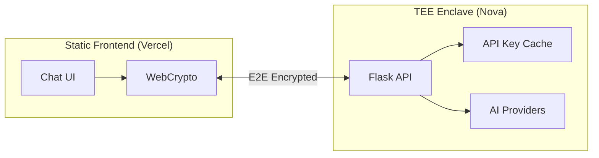
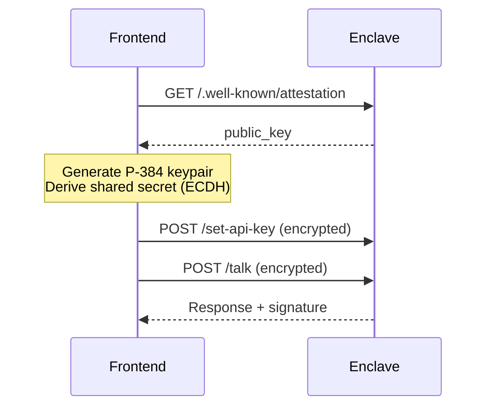

# Fully Secured Chat Bot

A verifiable AI chat application running on the Sparsity Nova TEE platform with a pure static frontend.

## Architecture



## Features

| Feature | Description |
|---------|-------------|
| **E2E Encryption** | P-384 ECDH + AES-256-GCM |
| **API Key Caching** | Set once, cached in enclave |
| **Signed Responses** | ETH signature (EIP-191) |
| **Static Deploy** | Vercel / GitHub Pages |
| **Multi-Platform** | OpenAI, Anthropic, Gemini |

## Quick Start

```bash
# Enclave
cd enclave
python -m venv .venv && source .venv/bin/activate
pip install -r requirements.txt && python app.py

# Frontend
cd frontend && npm install && npm run dev
```

## Local Development

Detailed steps to run the enclave backend and frontend locally with auto-reload for development.

### Prerequisites

- Python 3.10+
- Node.js 18+
- npm

### 1. Setup Enclave Backend

```bash
# Navigate to enclave directory
cd enclave

# Create virtual environment
python3 -m venv .venv

# Activate virtual environment
source .venv/bin/activate

# Install dependencies
pip install -r requirements.txt
```

### 2. Run Enclave Backend (Debug Mode)

Run Flask with debug mode enabled for auto-reload on code changes:

```bash
# Make sure venv is activated
source .venv/bin/activate

# Option 1: Using Flask debug mode
FLASK_DEBUG=1 python app.py

# Option 2: Using flask run command (recommended)
FLASK_APP=app.py FLASK_DEBUG=1 flask run --host=0.0.0.0 --port=8000

# Option 3: Using Flask environment variable
export FLASK_DEBUG=1
python app.py
```

> **Note:** Debug mode enables:
> - Auto-reload when Python files change
> - Interactive debugger in browser
> - Better error messages

### 3. Setup Frontend

Open a **new terminal** window:

```bash
# Navigate to frontend directory
cd frontend

# Install dependencies (first time only)
npm install
```

### 4. Run Frontend (Dev Mode)

```bash
# Start Next.js development server with hot reload
npm run dev
```

> **Note:** The dev server enables:
> - Hot Module Replacement (HMR) - instant updates without full refresh
> - Fast Refresh - preserves React component state
> - Auto-reload on file changes

### 5. Access the Application

| Service | URL | Description |
|---------|-----|-------------|
| Frontend | http://localhost:3000 | Chat UI |
| Backend | http://localhost:8000 | Flask API |
| Health Check | http://localhost:8000/ | API status |

### Development Tips

1. **Keep both terminals open** - one for enclave backend, one for frontend
2. **Backend changes** - Flask auto-reloads when you save Python files
3. **Frontend changes** - Next.js hot-reloads when you save React/TypeScript files
4. **Deactivate venv** - Run `deactivate` when done with enclave

## API Endpoints

| Endpoint | Description |
|----------|-------------|
| `GET /` | Health check (`api_key_available` status) |
| `POST /set-api-key` | Set API key (encrypted) |
| `POST /talk` | Chat (encrypted) |
| `GET /.well-known/attestation` | Attestation (runtime) |

## Encryption Flow



**Crypto specs:** P-384 ECDH → HKDF-SHA256 → AES-256-GCM (32-byte nonce)

## Project Structure

```
new-chat-bot/
├── enclave/           # TEE backend
│   ├── app.py         # Flask + API key caching
│   ├── enclave.py     # ECDH encryption
│   └── ai_models/     # OpenAI, Anthropic, Gemini
└── frontend/          # Next.js static site
    ├── src/lib/       # crypto.ts, attestation.ts
    └── src/app/       # page.tsx, verify/
```

## Deploy

**Enclave:** `enclaver build && enclaver push`

**Frontend:** `npm run build` → deploy `out/` to Vercel
