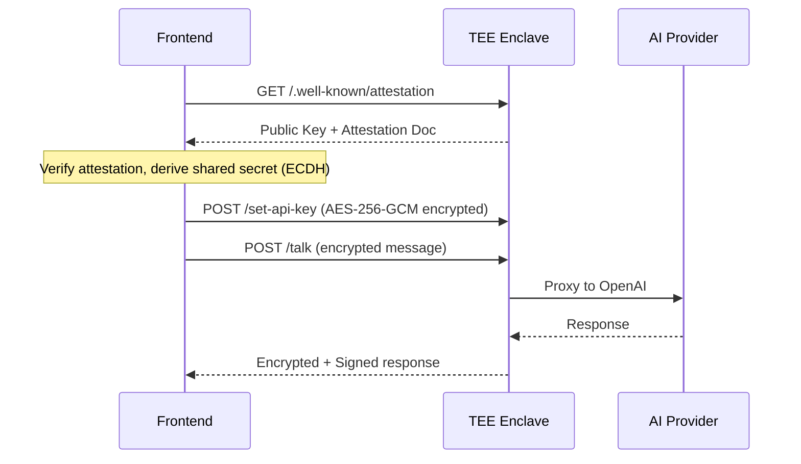

# Secured Chat Bot

A verifiable AI chat application running on the Sparsity Nova TEE platform with end-to-end encryption.

> 📖 **[Development Tutorial](./tutorial.md)** — Step-by-step guide to build and deploy this application.

## Architecture



**Crypto specs:** P-384 ECDH → HKDF-SHA256 → AES-256-GCM

## Features

| Feature              | Description                                     |
|----------------------|-------------------------------------------------|
| **E2E Encryption**   | P-384 ECDH + AES-256-GCM, API keys never exposed |
| **Signed Responses** | EIP-191 signature on every AI response          |
| **Attestation**      | AWS Nitro attestation verifiable in browser     |
| **Multi-Model**      | GPT-5.1, GPT-5, GPT-4.1, GPT-4o, GPT-4          |

## Quick Start

```bash
# Backend (uses mock Odyn for local dev)
cd enclave && pip install -r requirements.txt && python app.py

# Frontend (dev server)
cd frontend && npm install && npm run dev
```

| Service          | URL                                |
|------------------|------------------------------------|
| Frontend (Dev)   | http://localhost:3000/frontend     |
| Backend API      | http://localhost:8000              |
| Frontend (Built) | http://localhost:8000/frontend     |

## API Endpoints

| Endpoint                   | Method | Description                      |
|----------------------------|--------|----------------------------------|
| `/`                        | GET    | Health check                     |
| `/frontend`                | GET    | Static frontend files            |
| `/set-api-key`             | POST   | Set API key (encrypted)          |
| `/talk`                    | POST   | Chat (encrypted)                 |
| `/.well-known/attestation` | POST   | Get attestation + encryption key |

## Project Structure

```
secured-chat-bot/
├── enclave/           # Python Flask backend (runs in TEE)
│   ├── app.py         # Main service
│   ├── odyn.py        # TEE API wrapper
│   └── Dockerfile
└── frontend/          # Next.js frontend
    ├── src/lib/       # crypto.ts, attestation.ts
    └── src/components/# Chat UI
```

## Deploy to Nova Platform

See the **[Development Tutorial](./tutorial.md)** for detailed deployment instructions.
