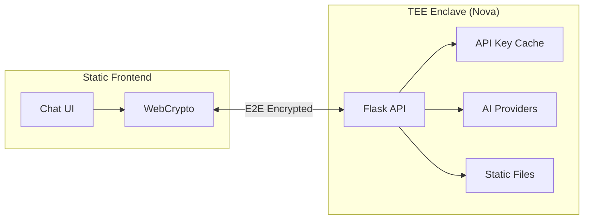
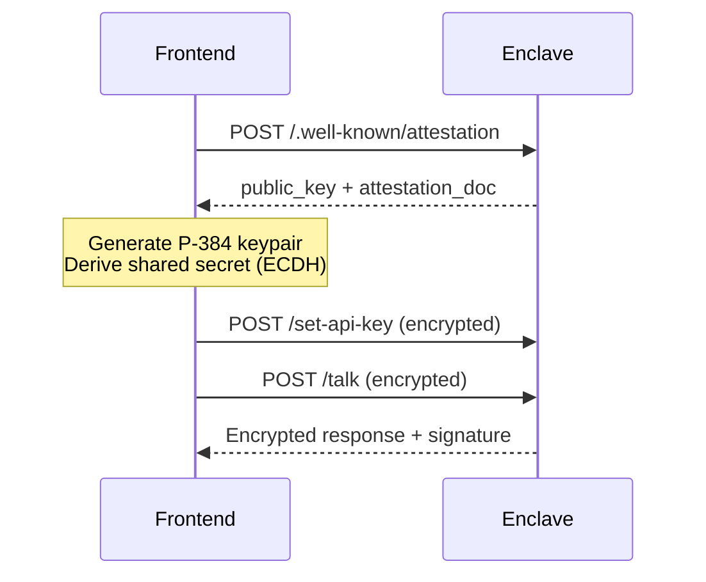

# Fully Secured Chat Bot

A verifiable AI chat application running on the Sparsity Nova TEE platform with a pure static frontend.

## Architecture



## Features

| Feature | Description |
|---------|-------------|
| **E2E Encryption** | P-384 ECDH + AES-256-GCM |
| **API Key Caching** | Set once, cached in enclave |
| **Signed Responses** | ETH signature (EIP-191) |
| **Static Frontend** | Served from enclave at `/frontend` |
| **Multi-Platform** | OpenAI, Anthropic, Gemini |

## Quick Start

```bash
# Enclave
cd enclave
python -m venv .venv && source .venv/bin/activate
pip install -r requirements.txt && python app.py

# Frontend (for development)
cd frontend && npm install && npm run dev
```

## Local Development

### Prerequisites

- Python 3.10+
- Node.js 18+
- npm

### 1. Setup Enclave Backend

```bash
cd enclave
python3 -m venv .venv
source .venv/bin/activate
pip install -r requirements.txt
```

### 2. Run Enclave Backend (Debug Mode)

```bash
source .venv/bin/activate
FLASK_DEBUG=1 python app.py
```

### 3. Setup & Run Frontend (Dev Mode)

```bash
cd frontend
npm install
npm run dev
```

### 4. Access the Application

| Service | URL | Description |
|---------|-----|-------------|
| Frontend (Dev) | http://localhost:3000 | Next.js dev server |
| Backend | http://localhost:8000 | Flask API |
| Frontend (Static) | http://localhost:8000/frontend | Built frontend |
| Health Check | http://localhost:8000/ | API status |

## API Endpoints

| Endpoint | Method | Description |
|----------|--------|-------------|
| `/` | GET | Health check (`api_key_available`, `frontend_available`) |
| `/frontend` | GET | Static frontend files |
| `/set-api-key` | POST | Set API key (encrypted) |
| `/talk` | POST | Chat (encrypted) |
| `/.well-known/attestation` | POST | Attestation (runtime) |

## Build & Deploy Frontend to Enclave

```bash
# Build frontend
cd frontend
npm run build

# Copy to enclave
cp -r out ../enclave/frontend
```

The built frontend is then served at `/frontend` by the enclave.

## Encryption Flow



**Crypto specs:** P-384 ECDH → HKDF-SHA256 → AES-256-GCM (32-byte nonce)

## Project Structure

```
secured-chat-bot/
├── enclave/           # TEE backend
│   ├── app.py         # Flask + API key caching + static serving
│   ├── enclave.py     # ECDH encryption
│   ├── ai_models/     # OpenAI, Anthropic, Gemini
│   └── frontend/      # Built frontend (from npm run build)
└── frontend/          # Next.js source
    ├── src/lib/       # crypto.ts, attestation.ts
    └── src/app/       # page.tsx, verify/
```

## Deploy

**Enclave:** `enclaver build && enclaver push`

**Frontend:** Built and bundled inside enclave (served at `/frontend`)
</CodeContent>
<parameter name="EmptyFile">false
