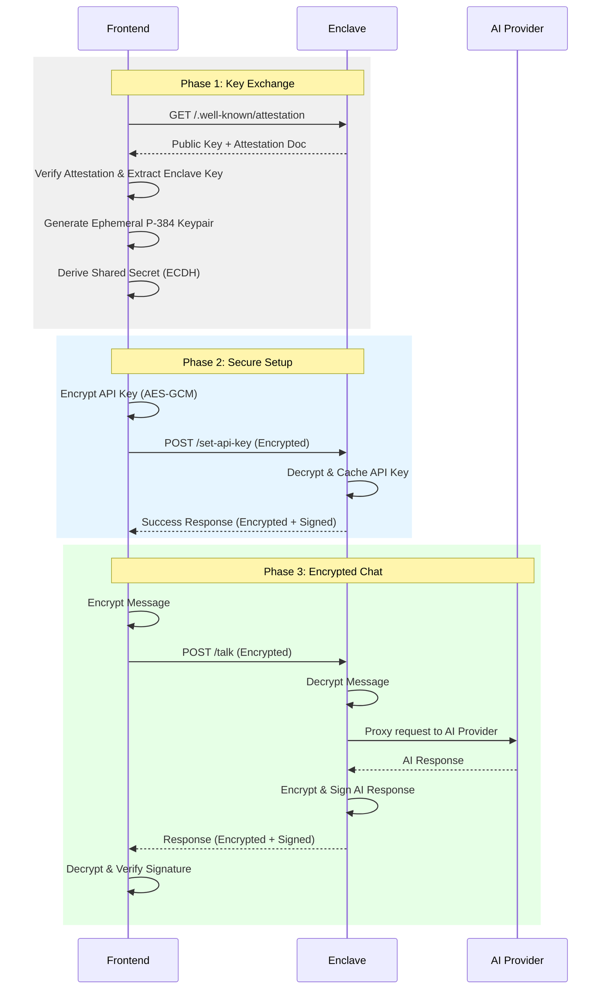

# Fully Secured Chat Bot Development Tutorial

This tutorial guides you through developing a Verifiable AI Chat Bot on the [Sparsity Nova Platform](https://sparsity.cloud). You will learn to build a TEE (Trusted Execution Environment) application with end-to-end encryption and a static React frontend.

---

## Table of Contents

1. [Architecture Overview](#1-architecture-overview)
2. [Develop Off-Chain Application (Enclave)](#2-develop-off-chain-application-enclave)
3. [Develop Frontend Application](#3-develop-frontend-application)
4. [Bundle and Test Locally](#4-bundle-and-test-locally)
5. [Create Dockerfile](#5-create-dockerfile)
6. [Deploy to Nova Platform](#6-deploy-to-nova-platform)
7. [Verify App Status](#7-verify-app-status)
8. [Troubleshooting](#8-troubleshooting)

---

## 1. Architecture Overview

### 1.1 Roles

The Secured Chat Bot system consists of three key components:

| Role | Description |
|------|-------------|
| **Static Frontend** | A React (Next.js) application that handles end-to-end encryption in the browser |
| **TEE Enclave** | A Flask backend running in a secure enclave that caches API keys and proxies AI requests |
| **AI Provider** | External AI services (like OpenAI) that process the chat messages |

### 1.2 Encryption Flow

The application ensures that neither the Nova Platform operator nor any intermediary can see the chat messages or the AI API keys.



---

## 2. Develop Off-Chain Application (Enclave)

### 2.1 Project Structure

The enclave application is a Python Flask service.

```
enclave/
├── app.py             # Flask service entry point
├── odyn.py            # Odyn API wrapper (TEE services)
├── ai_models/         # AI provider integrations (OpenAI, etc.)
├── requirements.txt   # Python dependencies
└── Dockerfile         # Container build
```

### 2.2 Odyn Wrapper

The Odyn wrapper provides a simple interface to the enclave's TEE services:

- **`eth_address()`**: Get the TEE's unique Ethereum address for signing
- **`encrypt_data()` / `decrypt_data()`**: TEE-managed ECDH encryption/decryption
- **`sign_message()`**: Sign responses for verifiability
- **`get_attestation()`**: Fetch the AWS Nitro attestation document

📄 **Source**: [enclave/odyn.py](enclave/odyn.py)

### 2.3 Main Application (Flask)

The `app.py` handles:
- **API Key Caching**: Stores the AI API key in memory within the secure enclave.
- **Encryption Logic**: Uses Odyn to decrypt incoming requests and encrypt outgoing responses.
- **Static Serving**: Serves the built frontend from the `frontend/` directory.

📄 **Source**: [enclave/app.py](enclave/app.py)

### 2.4 Local Development Setup

```bash
cd enclave
python3 -m venv .venv
source .venv/bin/activate
pip install -r requirements.txt
python app.py
```

> [!TIP]
> When running locally, the service uses a mock Odyn API at `odyn.sparsity.cloud:18000`. In production, it connects to the real TEE hardware on `localhost:18000`.

## 3. Develop Frontend Application

### 3.1 Project Structure

The frontend is a Next.js application built with TypeScript and Tailwind CSS.

```
frontend/
├── src/
│   ├── app/           # Next.js pages
│   ├── components/    # UI components (Chat, VerificationDialog)
│   └── lib/           # Crypto and Attestation logic
├── public/            # Static assets
└── package.json
```

### 3.2 Crypto Library

The `crypto.ts` library implements the client-side of the secure handshake:
- **`EnclaveClient.connect()`**: Fetches attestation and prepares the ECDH keys.
- **`EnclaveClient.encrypt()`**: Encrypts data for the enclave using the shared secret.
- **`EnclaveClient.decrypt()`**: Decrypted enclave responses.

📄 **Source**: [frontend/src/lib/crypto.ts](frontend/src/lib/crypto.ts)

### 3.3 Attestation Verification

The `attestation.ts` module handles the complex task of parsing AWS Nitro Enclave attestation documents. This allows the frontend to verify that the backend is indeed running inside a secure enclave before sending any sensitive data.

📄 **Source**: [frontend/src/lib/attestation.ts](frontend/src/lib/attestation.ts)

---

## 4. Bundle and Test Locally

### 4.1 Build the Frontend

Before the enclave can serve the frontend, you must build it:

```bash
cd frontend
npm install
npm run build
```

This generates a static export in the `out/` directory.

### 4.2 Integration Testing

1. Copy the built frontend to the enclave directory:
   ```bash
   cp -r out ../enclave/frontend
   ```

2. Start the enclave backend:
   ```bash
   cd ../enclave
   python app.py
   ```

3. Access the application at `http://localhost:8000/frontend/`.

---

## 5. Create Dockerfile

The Dockerfile bundles the Python environment and the static frontend into a single image.

📄 **Source**: [enclave/Dockerfile](enclave/Dockerfile)

To build the image locally:
```bash
docker build -t secured-chat-bot .
```

---

## 6. Deploy to Nova Platform

1. Go to [https://sparsity.cloud](https://sparsity.cloud)
2. Create a new application
3. Upload your `enclave/` directory (make sure it contains the `frontend/` build)
4. Deploy the application
5. Wait for the enclave to build and start

---

## 7. Verify App Status

### 7.1 Health Check

Access the root endpoint to see the service status:
```bash
curl https://<your-app>.nova.sparsity.cloud/
```

### 7.2 Attestation & Verification

In the Chat UI, click on the **Shield Icon** to view the full verification details. This includes:
- The raw and parsed **Attestation Document**
- **Public Keys** used for encryption
- **Signature verification** for AI responses

---

## 8. Troubleshooting

| Issue | Cause | Solution |
|-------|-------|----------|
| Decryption failed | Key mismatch | Refresh the frontend to reset ephemeral keys |
| Frontend 404 | `frontend/` dir missing | Ensure `npm run build` was run and files copied |
| AI calls failing | Invalid API key | Set a valid OpenAI API key via the UI |
| Not in Enclave | `IN_ENCLAVE` env var | Check Dockerfile and deployment settings |

---

## Summary

In this tutorial, you have learned how to:

1. ✅ Build a secure enclave backend using **Flask** and **Odyn**.
2. ✅ Implement **End-to-End Encryption** between a browser and a TEE.
3. ✅ Parse and verify **AWS Nitro Attestation Documents** in the frontend.
4. ✅ Securely cache and use **AI API keys** within a TEE.
5. ✅ Deploy a full-stack verifiable application to the **Nova Platform**.

**Congratulations!** You have built a fully secured, verifiable AI Chat Bot! 🤖🛡️
